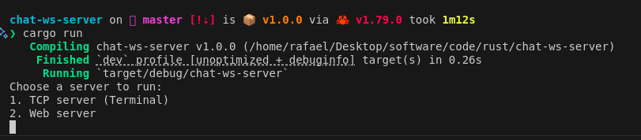
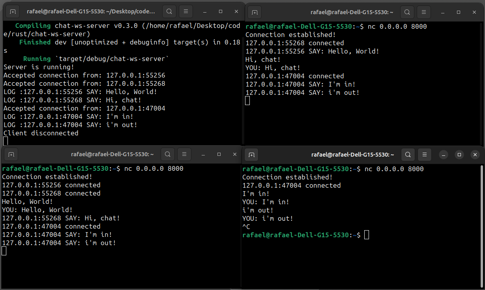

# Chat Server 1.0

> Server options

> Simple socket the client use the terminal to connect to the server and send messages to the chat room.

This is a chat server implementation using the Rust. The server accepts TCP connections from clients and allows them to communicate with each other in a chat room. It handles incoming messages from clients and broadcasts them to all connected clients.

## Features

- Accepts TCP connections from multiple clients.
- Handles incoming messages from clients.
- Broadcasts messages to all connected clients in the chat room.
- Supports logging of client messages.
- Includes message control functionality for processing client messages.
- Allows the user to choose between running a TCP server or a Web server.

## Getting Started

1. Clone this repository to your local machine.
2. Make sure you have Rust installed.
3. Run the server using the command `cargo run`.
4. Choose between running a TCP server or a Web server by following the instructions in the terminal.
5. Clients can connect to the server using a TCP client or a WebSocket client, depending on the chosen server type.

## Configuration

The server can be configured through the **server_config.yml** file.

## Contributing

Contributions to this project are welcome. If you find any issues or have suggestions for improvements, please open an issue or submit a pull request.
